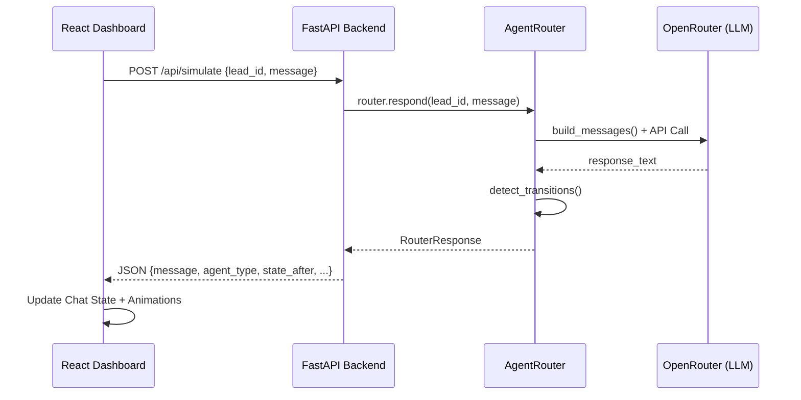

# Diseño Técnico — Simulador Diamante 💎

## Arquitectura de Comunicación

## Cambios en el Backend (FastAPI)

- **Nuevo Endpoint**: `POST /api/simulate`
  - Body: `{ lead_id: str, message: str }`
  - Logic: Instanciar `AgentRouter` y retornar el objeto `RouterResponse` convertido a dict.
  - File: `api/main.py`

## Cambios en el Frontend (Next.js)

- **Componente**: `dashboard/src/components/SalesSimulator.tsx`
  - Reemplazar el `iframe` por un componente funcional.
  - State: `messages` (lista de objetos), `loading` (boolean), `leadId` (string).
  - Estética: Burbujas de chat premium con degradados Oro y Tinta. Animaciones de Framer Motion para la entrada de mensajes.

## Consideraciones de Seguridad

- Se usará el `lead_id` para persistir la conversación en `conversations.json`.
- El modo `dry_run` se puede activar vía query param para pruebas sin costo de tokens.
